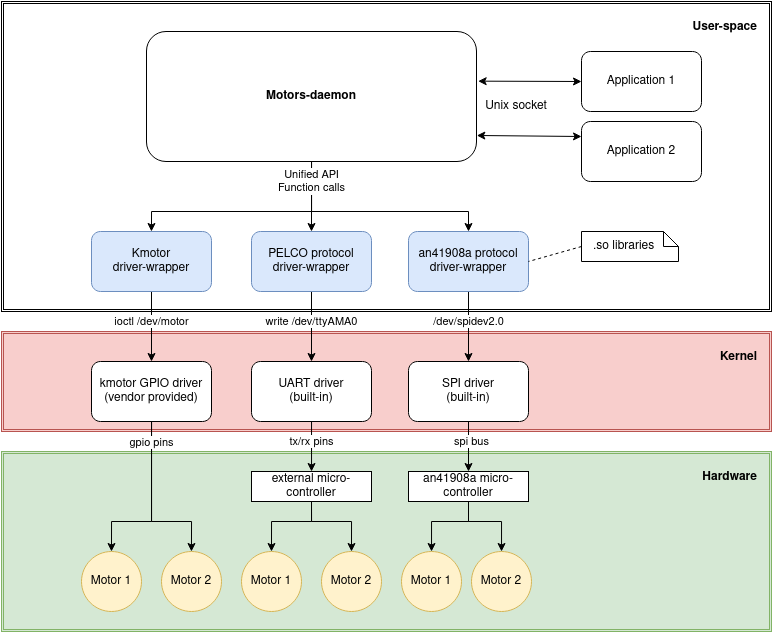

## Thoughts on the structure of _motors API_.

### Brief overview
Motors-daemon --- a separate motors-handling daemon with different backends (_driver-wrappers_). 
Backends are pluggable extensions which add platform/protocol-specific functionality such as UART protocol, an41908a-based, CamHi-based controls.
The daemon unites them and exposes unified API for a camera applications.

### Abstraction layers
1. #### _Device drivers_ (kernel modules)
  Drivers create a device file like `/dev/motor` encapsulate timers/phase/gpio control logic (questionable, shouldn't it be implemented at a user-space?). Kernel module files can be taken from an original firmware or compiled from source.

2. #### _Driver wrappers_ (libraries)
  Driver-specific, small programs which proxy function calls and **provide the standardized interface** to higher-level programs (`Adapter pattern`). 
  They are served with corresponding _device-drivers_ and usually wrap `ioctl` calls. But in some cases (such as _PELCO_ protocol in [xm-uart/main.c](https://github.com/OpenIPC/motors/blob/5993229147e3631490a3addd14803946bb7b5df7/xm-uart/main.c)) they encapsulate the details of protocol implementation.

  "User" can write his own _wrapper_ and plug it into the _motors-daemon_ to add support for new _device driver_.

3. #### _Motors-daemon_
The core of the motors API. It runs as a daemon and listens to commands via `UNIX socket`. 
Other applications connect to the socket and send _Pan/Tilt/Zoom/Focus/IRCut/AF_ commands (The full list of supported commands should be defined in the API specification). Applications may also want to get info about day/night state, current preset etc.
 User should register a _device-wrapper_ by writing a path to the suitable _driver-wrapper_ in a config file.

### Daemon responsibilities
 1. Read config which contains default params and a path to _wrapper library_.
 2. Load wrapper as `.so` library.
 3. Call initialization function of the _wrapper library_.
 3. Translate socket requests to library calls.
 4. Return states of connected peripherals.

### List of capabilities
#### Controls
 - PTZ
 - AF (start, stop)
  - IRCut
  - IR backlight
  - set/call preset
  - calibrate max/min motor positions
  - set step size 
#### States
  -  get day/night state
  -  get presets
  -  get max/min motor positions
#### Response status
  - functionality not supported
  - invalid command
  - invocation failed
  - success

### Roadmap

- [ ] Decide on unified API for _driver wrappers_. The list of functions they provide to motors-daemon.
- [ ] Adjust existing _wrappers'_ signatures ([xm-kmotor/main.c](https://github.com/OpenIPC/motors/blob/5993229147e3631490a3addd14803946bb7b5df7/xm-kmotor/main.c) and others) according to the API.
- [ ] Decide on motors-daemon _Unix sockets_ API.
- [ ] Implement motors-daemon as a server that listens to socket connections.
- [ ] Implement motors-daemon's plug-in logic to call functions of the provided _driver-wrapper_.

### Problems
1. Should the daemon use only one _driver-wrapper_ at a time (specified in the config) or it can combine drivers with different functionality (for example, one stands for PTZ and other manages IRCut)?
2. On which layer the protocol-specific logic should live - _kernel module_ or _driver wrapper_?
    -  A kernel module should be as lightweight as possible and provide basic functionality via `ioctl` or just create a device and do _pinmuxing_.
    - Driver-wrapper (library) is a thin adapter layer between a _hardware driver_ and the _daemon_. 
So, theoretically it should NOT implement any protocol-specific logic. 
But in practice the protocol depends on a board and implemented inside _driver-wrapper_ (like _PELCO_).
3. Also, when adding new gpio motors, for example, should we write a user-space library (_driver-wrapper_) and skip the device driver layer (because linux already provides a way to manage gpio without custom kernel module)? 
Or place the logic inside a new kernel module and leave the _driver-wrapper_ as thin as possible?
