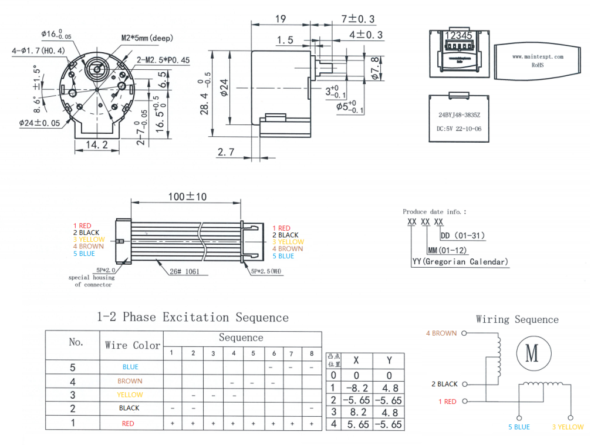

This code was developed on a GrainMedia GM8136 board with 24BYJ48 stepper motors where the gpiochip /dev interface was not available. This should be portable to any other platform with sysfs GPIO access. 

### Usage:

Configure your motor GPIO:

`fw_setenv gpio_motor 1 2 3 4 5 6 7 8`

Move the motor:

`sysfs-motor <motor (pan/tilt)> <steps> <delay_ms>`

### Motor Diagram:

